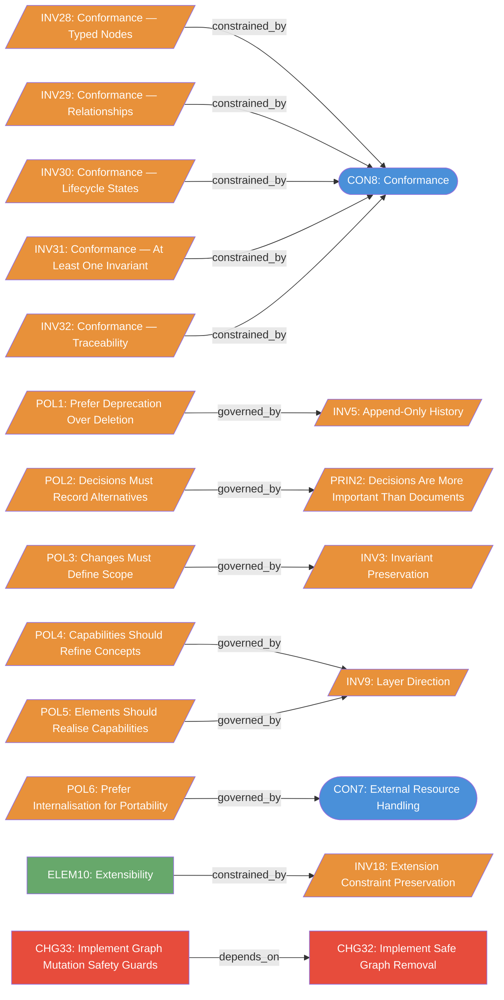

# Diagrams

## Relationship Graph

```mermaid
graph TD
  classDef intent fill:#4A90D9,color:#fff
  classDef state fill:#67A86B,color:#fff
  classDef invariant fill:#E8913A,color:#fff
  classDef decision fill:#9B59B6,color:#fff
  classDef change fill:#E74C3C,color:#fff
  classDef meta fill:#95A5A6,color:#fff

  subgraph intent ["Intent"]
    INT1([INT1: System Provenance]):::intent
    CON1([CON1: Layered Abstraction]):::intent
    CON2([CON2: Decision-Driven Evolution]):::intent
    CON3([CON3: Append-Only History]):::intent
    CON4([CON4: Recursive Composition]):::intent
    CON5([CON5: Process as Structure]):::intent
    CON6([CON6: Format Agnosticism]):::intent
    CON7([CON7: External Resource Handling]):::intent
    CON8([CON8: Conformance]):::intent
    CAP1([CAP1: Cross-Layer Traceability]):::intent
    CAP2([CAP2: Decision Recording]):::intent
    CAP3([CAP3: Invariant Enforcement]):::intent
    CAP4([CAP4: Change Tracking]):::intent
    CAP5([CAP5: Recursive Modelling]):::intent
    CAP6([CAP6: Process Modelling]):::intent
    CAP7([CAP7: Flexible Representation]):::intent
    CAP8([CAP8: External Resource Referencing]):::intent
    CAP9([CAP9: Branching]):::intent
    CAP10([CAP10: Merging]):::intent
    CAP11([CAP11: Revival]):::intent
    CON9([CON9: System Provenance Profile]):::intent
    CAP12([CAP12: Product Repository Modelling Guidance]):::intent
  end

  subgraph state ["State"]
    ELEM1[ELEM1: Domain Node Family]:::state
    ELEM2[ELEM2: Process Node Family]:::state
    ELEM3[ELEM3: Artefact Node Family]:::state
    ELEM4[ELEM4: Evolution Node Family]:::state
    ELEM5[ELEM5: Projection Node Family]:::state
    ELEM6[ELEM6: Relationship Type Registry]:::state
    ELEM7[ELEM7: External Reference Model]:::state
    ELEM8[ELEM8: File Representation]:::state
    ELEM9[ELEM9: Non-Linear Evolution]:::state
    ELEM10[ELEM10: Extensibility]:::state
    REAL1[REAL1: Markdown Representation]:::state
    REAL2[REAL2: Single-File Form]:::state
    REAL3[REAL3: Multi-Document Form]:::state
    REAL4[REAL4: Recursive Folder Form]:::state
    REAL5[REAL5: JSON Serialisation]:::state
    PROT1[PROT1: Decision Lifecycle]:::state
    PROT2[PROT2: Change Lifecycle]:::state
    PROT3[PROT3: Node Lifecycle]:::state
    STG1_DEC_PROPOSED[STG1-DEC-PROPOSED: proposed]:::state
    STG2_DEC_ACCEPTED[STG2-DEC-ACCEPTED: accepted]:::state
    STG3_DEC_IMPLEMENTED[STG3-DEC-IMPLEMENTED: implemented]:::state
    STG4_DEC_ADOPTED[STG4-DEC-ADOPTED: adopted]:::state
    STG5_DEC_SUPERSEDED[STG5-DEC-SUPERSEDED: superseded]:::state
    STG6_DEC_ABANDONED[STG6-DEC-ABANDONED: abandoned]:::state
    STG7_DEC_DEFERRED[STG7-DEC-DEFERRED: deferred]:::state
    STG8_CHG_DEFINED[STG8-CHG-DEFINED: defined]:::state
    STG9_CHG_INTRODUCED[STG9-CHG-INTRODUCED: introduced]:::state
    STG10_CHG_IN_PROGRESS[STG10-CHG-IN_PROGRESS: in_progress]:::state
    STG11_CHG_COMPLETE[STG11-CHG-COMPLETE: complete]:::state
    STG12_CHG_CONSOLIDATED[STG12-CHG-CONSOLIDATED: consolidated]:::state
    STG13_NODE_PROPOSED[STG13-NODE-PROPOSED: proposed]:::state
    STG14_NODE_ACTIVE[STG14-NODE-ACTIVE: active]:::state
    STG15_NODE_DEPRECATED[STG15-NODE-DEPRECATED: deprecated]:::state
    STG16_NODE_RETIRED[STG16-NODE-RETIRED: retired]:::state
    ART1[ART1: System Comparisons]:::state
    ART2[ART2: Document Workspace Example]:::state
    ART3[ART3: Planning Workflow Example]:::state
    ART4[ART4: System Provenance Profile Guidance]:::state
  end

  subgraph invariant ["Invariants"]
    INV1[/INV1: Concept Independence/]:::invariant
    INV2[/INV2: Decision-Change Linkage/]:::invariant
    INV3[/INV3: Invariant Preservation/]:::invariant
    INV4[/INV4: Recursive Consistency/]:::invariant
    INV5[/INV5: Append-Only History/]:::invariant
    INV6[/INV6: Node Identity/]:::invariant
    INV7[/INV7: Relationship Validity/]:::invariant
    INV8[/INV8: Gate Justification/]:::invariant
    INV9[/INV9: Layer Direction/]:::invariant
    INV10[/INV10: Realisation Implements Element/]:::invariant
    INV11[/INV11: Stage Ordering/]:::invariant
    INV12[/INV12: Decision Affects Reference/]:::invariant
    INV13[/INV13: Decision Selection/]:::invariant
    INV14[/INV14: Change Scope/]:::invariant
    INV15[/INV15: Change Operations/]:::invariant
    INV16[/INV16: Change Lifecycle State/]:::invariant
    INV17[/INV17: Node Addressability/]:::invariant
    INV18[/INV18: Extension Constraint Preservation/]:::invariant
    INV19[/INV19: External Reference Role Required/]:::invariant
    INV20[/INV20: External Reference Directionality/]:::invariant
    INV28[/INV28: Conformance — Typed Nodes/]:::invariant
    INV29[/INV29: Conformance — Relationships/]:::invariant
    INV30[/INV30: Conformance — Lifecycle States/]:::invariant
    INV31[/INV31: Conformance — At Least One Invariant/]:::invariant
    INV32[/INV32: Conformance — Traceability/]:::invariant
    INV21[/INV21: Text Field Duality/]:::invariant
    INV22[/INV22: Strict Type Enums/]:::invariant
    INV23[/INV23: Retired Node Relationship Guard/]:::invariant
    INV24[/INV24: No Duplicate Relationships/]:::invariant
    INV25[/INV25: Relationship Endpoint Type Validity/]:::invariant
    INV26[/INV26: Retirement Impact Awareness/]:::invariant
    INV27[/INV27: Auto-sync JSON and Markdown representations/]:::invariant
    PRIN1[/PRIN1: Separate What From Why From How/]:::invariant
    PRIN2[/PRIN2: Decisions Are More Important Than Documents/]:::invariant
    PRIN3[/PRIN3: Everything Has Identity/]:::invariant
    PRIN4[/PRIN4: Think Graph, Not Timeline/]:::invariant
    PRIN5[/PRIN5: Separate State From History/]:::invariant
    POL1[/POL1: Prefer Deprecation Over Deletion/]:::invariant
    POL2[/POL2: Decisions Must Record Alternatives/]:::invariant
    POL3[/POL3: Changes Must Define Scope/]:::invariant
    POL4[/POL4: Capabilities Should Refine Concepts/]:::invariant
    POL5[/POL5: Elements Should Realise Capabilities/]:::invariant
    POL6[/POL6: Prefer Internalisation for Portability/]:::invariant
    POL7[/POL7: Security — Node Identity Integrity/]:::invariant
    POL8[/POL8: Security — Relationship Consistency/]:::invariant
    POL9[/POL9: Security — Controlled Modification/]:::invariant
    POL10[/POL10: Root Entry Point Identification/]:::invariant
    POL11[/POL11: Root Entry Point Location/]:::invariant
    POL12[/POL12: Multi-Document Hub/]:::invariant
    POL13[/POL13: Single-File Node Extension/]:::invariant
    POL14[/POL14: Folder Node Naming/]:::invariant
    POL15[/POL15: Grouping Folders/]:::invariant
    POL16[/POL16: Parent Linking Implicit/]:::invariant
    POL17[/POL17: Relationship Notation Flexibility/]:::invariant
    POL18[/POL18: Frontmatter Is Metadata Only/]:::invariant
    POL19[/POL19: README Links Only to Present Files/]:::invariant
    POL20[/POL20: Subsystem Representation Heuristic/]:::invariant
  end

  subgraph decision ["Decisions"]
    DEC1{{DEC1: Separate Domain From Process From Evolution}}:::decision
    DEC2{{DEC2: Make Decisions First-Class Entities}}:::decision
    DEC3{{DEC3: Distinguish Invariants From Principles From Policies}}:::decision
    DEC4{{DEC4: Add Process Modelling}}:::decision
    DEC5{{DEC5: Format-Agnostic With Markdown as Primary Representation}}:::decision
    DEC6{{DEC6: Recursive Composition Using Same Conventions}}:::decision
    DEC7{{DEC7: Append-Only History}}:::decision
    DEC8{{DEC8: Support External Resources via Reference and Internalisation}}:::decision
    DEC9{{DEC9: Allow Array-of-Lines for Text Fields}}:::decision
    DEC10{{DEC10: Use Strict Enums for Core Types}}:::decision
    DEC11{{DEC11: Only Link to Present Files in README}}:::decision
    DEC12{{DEC12: Remove Navigation and Document Roles from README}}:::decision
    DEC13{{DEC13: Layer-Dependent Invariant Preservation}}:::decision
    DEC14{{DEC14: Internalise Design Archive into SysProM JSON}}:::decision
    DEC15{{DEC15: Size-Based Subsystem Splitting}}:::decision
    DEC16{{DEC16: Add Bidirectional Spec-Kit Interoperability}}:::decision
    DEC17{{DEC17: Add Task Subcommand for Change Plan Tracking}}:::decision
    DEC18{{DEC18: Recursive Change Nodes for Planning}}:::decision
    DEC19{{DEC19: Extend Lifecycle with Temporal Timestamps}}:::decision
    DEC20{{DEC20: Adopt Commander.js for CLI}}:::decision
    DEC21{{DEC21: Adopt TypeDoc for Documentation}}:::decision
    DEC22{{DEC22: Adopt Turborepo for Build Orchestration}}:::decision
    DEC23{{DEC23: Enforce Conventional Commits and Automated Releases}}:::decision
    DEC24{{DEC24: Eliminate Type Assertions}}:::decision
    DEC25{{DEC25: Ship Compiled JavaScript}}:::decision
    DEC26{{DEC26: Auto-Generate Node IDs}}:::decision
    DEC27{{DEC27: CLI UX Improvements}}:::decision
    DEC28{{DEC28: Unify CLI with Zod-Driven Command Definitions}}:::decision
    DEC29{{DEC29: Unify Library API and CLI with defineOperation}}:::decision
    DEC30{{DEC30: Distribute SysProM as a Claude Code Plugin}}:::decision
    DEC31{{DEC31: Bidirectional Sync by Default}}:::decision
    DEC32{{DEC32: Add MCP Server for Programmatic API Access}}:::decision
    DEC33{{DEC33: Abstract External Format Interop into Keyed Provider Registry}}:::decision
    DEC34{{DEC34: Safe Graph Removal with Soft Delete Default}}:::decision
    DEC35{{DEC35: Graph Mutation Safety Guards}}:::decision
    DEC36{{DEC36: Default input resolution and init command}}:::decision
    DEC37{{DEC37: Add YAML and multi-file JSON serialisation formats}}:::decision
    DEC38{{DEC38: Convert file-path positional args to flags}}:::decision
    DEC39{{DEC39: Fix MCP write operations not persisting}}:::decision
    DEC40{{DEC40: Fix init path suffix doubling}}:::decision
    DEC41{{DEC41: Add deterministic graph inference}}:::decision
    DEC42{{DEC42: Enhance impact analysis for SysML/ArchiMate parity}}:::decision
    DEC43{{DEC43: Expand endpoint type matrix for governance modelling}}:::decision
    DEC44{{DEC44: Adopt Graph-Native Task Lifecycle Model}}:::decision
  end

  subgraph change ["Changes"]
    CHG1[CHG1: Initial Model]:::change
    CHG2[CHG2: Add Process Modelling]:::change
    CHG3[CHG3: Add File Representation Conventions]:::change
    CHG4[CHG4: Add External Resources Model]:::change
    CHG5[CHG5: Add Lifecycle Protocols]:::change
    CHG6[CHG6: Encode Full Normative Specification]:::change
    CHG7[CHG7: Add Text Field Duality]:::change
    CHG8[CHG8: Switch to Strict Enums with Labelled Definitions]:::change
    CHG9[CHG9: Fix Dead Links in Subsystem READMEs]:::change
    CHG10[CHG10: Remove Navigation and Document Roles from README]:::change
    CHG11[CHG11: Make Invariant Preservation Layer-Dependent]:::change
    CHG12[CHG12: Internalise Design Archive]:::change
    CHG13[CHG13: Add Size-Based Subsystem Splitting and Auto-Grouping]:::change
    CHG14[CHG14: Implement Spec-Kit File Support]:::change
    CHG15[CHG15: Implement task CLI Command for Subagent Plan Tracking]:::change
    CHG16[CHG16: Implement Plan Command with Recursive Task Model]:::change
    CHG17[CHG17: Implement Temporal Support]:::change
    CHG18[CHG18: Migrate CLI to Commander.js]:::change
    CHG19[CHG19: Add TypeDoc Documentation Pipeline]:::change
    CHG20[CHG20: Add Turborepo Build Orchestration]:::change
    CHG21[CHG21: Add CI/CD Pipeline]:::change
    CHG22[CHG22: Remove Type Assertions]:::change
    CHG23[CHG23: Switch to Compiled Distribution]:::change
    CHG24[CHG24: Add Auto-ID Generation to CLI]:::change
    CHG25[CHG25: CLI UX Improvements]:::change
    CHG26[CHG26: Implement defineCommand Pattern]:::change
    CHG27[CHG27: Implement defineOperation Pattern]:::change
    CHG28[CHG28: Implement Claude Code Plugin]:::change
    CHG29[CHG29: Implement Bidirectional Sync Command]:::change
    CHG30[CHG30: Implement MCP Server]:::change
    CHG31[CHG31: Implement Keyed Provider Registry for External Formats]:::change
    CHG32[CHG32: Implement Safe Graph Removal]:::change
    CHG33[CHG33: Implement Graph Mutation Safety Guards]:::change
    CHG34[CHG34: Add default input resolution and init command]:::change
    CHG35[CHG35: Add YAML Support and Multi-File JSON Formats]:::change
    CHG36[CHG36: Convert file-path positional args to flags]:::change
    CHG37[CHG37: Fix MCP persistence bug]:::change
    CHG38[CHG38: Fix init path suffix doubling]:::change
    CHG39[CHG39: Implement deterministic graph inference]:::change
    CHG40[CHG40: Enhance impact analysis for bidirectional traversal and polarity]:::change
    CHG41[CHG41: Implement system provenance profile and broaden endpoint modelling]:::change
    CHG42[CHG42: Implement Graph-Native Task Lifecycle and Blockage Tracking]:::change
  end

  subgraph meta ["Meta"]
    VIEW1[VIEW1: Domain View]:::meta
    VIEW2[VIEW2: Process View]:::meta
    VIEW3[VIEW3: Evolution View]:::meta
  end


  CON1 -->|refines| INT1
  CON2 -->|refines| INT1
  CON3 -->|refines| INT1
  CON4 -->|refines| INT1
  CON5 -->|refines| INT1
  CON6 -->|refines| INT1
  CON7 -->|refines| INT1
  CON8 -->|refines| INT1
  CAP1 -->|refines| CON1
  CAP2 -->|refines| CON2
  CAP3 -->|refines| CON2
  CAP4 -->|refines| CON3
  CAP5 -->|refines| CON4
  CAP6 -->|refines| CON5
  CAP7 -->|refines| CON6
  CAP8 -->|refines| CON7
  CAP9 -->|refines| CON4
  CAP10 -->|refines| CON4
  CAP11 -->|refines| CON3
  INV28 -->|constrained_by| CON8
  INV29 -->|constrained_by| CON8
  INV30 -->|constrained_by| CON8
  INV31 -->|constrained_by| CON8
  INV32 -->|constrained_by| CON8
  POL1 -->|governed_by| INV5
  POL2 -->|governed_by| PRIN2
  POL3 -->|governed_by| INV3
  POL4 -->|governed_by| INV9
  POL5 -->|governed_by| INV9
  POL6 -->|governed_by| CON7
  POL10 -->|part_of| ELEM8
  POL11 -->|part_of| ELEM8
  POL12 -->|part_of| ELEM8
  POL13 -->|part_of| ELEM8
  POL14 -->|part_of| ELEM8
  POL15 -->|part_of| ELEM8
  POL16 -->|part_of| ELEM8
  POL17 -->|part_of| ELEM8
  POL18 -->|part_of| ELEM8
  ELEM1 -->|realises| CAP1
  ELEM2 -->|realises| CAP6
  ELEM3 -->|realises| CAP6
  ELEM4 -->|realises| CAP2
  ELEM4 -->|realises| CAP4
  ELEM6 -->|realises| CAP1
  ELEM7 -->|realises| CAP8
  ELEM8 -->|realises| CAP7
  ELEM9 -->|realises| CAP9
  ELEM9 -->|realises| CAP10
  ELEM9 -->|realises| CAP11
  ELEM10 -->|realises| CAP7
  ELEM10 -->|constrained_by| INV18
  REAL1 -->|implements| ELEM1
  REAL1 -->|implements| ELEM2
  REAL1 -->|implements| ELEM3
  REAL1 -->|implements| ELEM4
  REAL2 -->|implements| ELEM8
  REAL3 -->|implements| ELEM8
  REAL4 -->|implements| ELEM8
  REAL5 -->|implements| ELEM1
  REAL5 -->|implements| ELEM2
  REAL5 -->|implements| ELEM3
  REAL5 -->|implements| ELEM4
  STG1_DEC_PROPOSED -->|part_of| PROT1
  STG2_DEC_ACCEPTED -->|part_of| PROT1
  STG2_DEC_ACCEPTED -->|must_follow| STG1_DEC_PROPOSED
  STG3_DEC_IMPLEMENTED -->|part_of| PROT1
  STG3_DEC_IMPLEMENTED -->|must_follow| STG2_DEC_ACCEPTED
  STG4_DEC_ADOPTED -->|part_of| PROT1
  STG4_DEC_ADOPTED -->|must_follow| STG3_DEC_IMPLEMENTED
  STG5_DEC_SUPERSEDED -->|part_of| PROT1
  STG5_DEC_SUPERSEDED -->|precedes| STG4_DEC_ADOPTED
  STG6_DEC_ABANDONED -->|part_of| PROT1
  STG6_DEC_ABANDONED -->|precedes| STG2_DEC_ACCEPTED
  STG7_DEC_DEFERRED -->|part_of| PROT1
  STG7_DEC_DEFERRED -->|precedes| STG2_DEC_ACCEPTED
  STG8_CHG_DEFINED -->|part_of| PROT2
  STG9_CHG_INTRODUCED -->|part_of| PROT2
  STG9_CHG_INTRODUCED -->|must_follow| STG8_CHG_DEFINED
  STG10_CHG_IN_PROGRESS -->|part_of| PROT2
  STG10_CHG_IN_PROGRESS -->|must_follow| STG9_CHG_INTRODUCED
  STG11_CHG_COMPLETE -->|part_of| PROT2
  STG11_CHG_COMPLETE -->|must_follow| STG10_CHG_IN_PROGRESS
  STG12_CHG_CONSOLIDATED -->|part_of| PROT2
  STG12_CHG_CONSOLIDATED -->|must_follow| STG11_CHG_COMPLETE
  STG13_NODE_PROPOSED -->|part_of| PROT3
  STG14_NODE_ACTIVE -->|part_of| PROT3
  STG14_NODE_ACTIVE -->|must_follow| STG13_NODE_PROPOSED
  STG15_NODE_DEPRECATED -->|part_of| PROT3
  STG15_NODE_DEPRECATED -->|must_follow| STG14_NODE_ACTIVE
  STG16_NODE_RETIRED -->|part_of| PROT3
  STG16_NODE_RETIRED -->|must_follow| STG15_NODE_DEPRECATED
  ART1 -->|affects| DEC4
  DEC1 -->|affects| ELEM1
  DEC1 -->|affects| ELEM2
  DEC1 -->|affects| ELEM4
  DEC1 -->|must_preserve| INV1
  DEC2 -->|affects| ELEM4
  DEC2 -->|must_preserve| INV2
  DEC2 -->|must_preserve| INV3
  DEC3 -->|affects| INV1
  DEC3 -->|affects| PRIN1
  DEC3 -->|affects| POL1
  DEC3 -->|must_preserve| INV3
  DEC4 -->|affects| ELEM2
  DEC4 -->|affects| ELEM3
  DEC4 -->|must_preserve| INV4
  DEC5 -->|affects| REAL1
  DEC5 -->|must_preserve| INV4
  DEC6 -->|affects| REAL4
  DEC6 -->|must_preserve| INV4
  DEC7 -->|must_preserve| INV5
  DEC8 -->|affects| ELEM7
  DEC8 -->|affects| REAL5
  DEC8 -->|affects| REAL1
  DEC8 -->|affects| INV3
  DEC8 -->|affects| ART1
  DEC8 -->|affects| ART2
  DEC8 -->|affects| ART3
  DEC8 -->|must_preserve| INV19
  DEC8 -->|must_preserve| INV20
  DEC8 -->|must_preserve| INV21
  DEC8 -->|must_preserve| INV22
  DEC8 -->|must_preserve| INV18
  DEC8 -->|must_preserve| POL19
  DEC8 -->|must_preserve| INV3
  DEC8 -->|must_preserve| POL20
  DEC9 -->|affects| REAL5
  DEC9 -->|affects| REAL1
  DEC9 -->|must_preserve| INV21
  DEC10 -->|affects| REAL5
  DEC10 -->|must_preserve| INV22
  DEC10 -->|must_preserve| INV18
  DEC11 -->|affects| REAL1
  DEC11 -->|must_preserve| POL19
  DEC12 -->|affects| REAL1
  DEC13 -->|affects| INV3
  DEC13 -->|must_preserve| INV3
  DEC14 -->|affects| ART1
  DEC14 -->|affects| ART2
  DEC14 -->|affects| ART3
  DEC15 -->|affects| REAL1
  DEC15 -->|must_preserve| POL20
  DEC16 -->|affects| ELEM3
  DEC16 -->|must_preserve| INV4
  DEC16 -->|must_preserve| INV5
  DEC16 -->|must_preserve| INV6
  DEC16 -->|must_preserve| INV21
  DEC16 -->|must_preserve| INV22
  DEC17 -->|affects| CHG14
  DEC18 -->|must_preserve| INV2
  DEC19 -->|must_preserve| INV2
  DEC20 -->|must_preserve| INV2
  DEC21 -->|must_preserve| INV2
  DEC22 -->|must_preserve| INV2
  DEC23 -->|must_preserve| INV2
  DEC24 -->|must_preserve| INV2
  DEC25 -->|must_preserve| INV2
  DEC26 -->|must_preserve| INV2
  DEC27 -->|must_preserve| INV2
  DEC28 -->|must_preserve| INV2
  DEC29 -->|must_preserve| INV2
  DEC33 -->|supersedes| CHG14
  DEC33 -->|must_preserve| CON6
  DEC34 -->|must_preserve| INV23
  DEC35 -->|must_preserve| INV24
  DEC35 -->|must_preserve| INV25
  DEC35 -->|must_preserve| INV26
  DEC41 -->|must_preserve| INV1
  DEC41 -->|must_preserve| INV2
  CHG1 -->|affects| DEC1
  CHG1 -->|affects| DEC2
  CHG1 -->|affects| DEC7
  CHG2 -->|affects| DEC3
  CHG2 -->|affects| DEC4
  CHG3 -->|affects| DEC5
  CHG3 -->|affects| DEC6
  CHG4 -->|affects| DEC8
  CHG4 -->|affects| DEC4
  CHG4 -->|affects| DEC2
  CHG5 -->|affects| DEC4
  CHG6 -->|affects| DEC2
  CHG7 -->|affects| DEC9
  CHG8 -->|affects| DEC10
  CHG9 -->|affects| DEC11
  CHG10 -->|affects| DEC12
  CHG11 -->|affects| DEC13
  CHG12 -->|affects| DEC14
  CHG13 -->|affects| DEC15
  CHG14 -->|affects| DEC16
  CHG15 -->|affects| DEC17
  CHG16 -->|implements| DEC18
  CHG17 -->|implements| DEC19
  CHG18 -->|implements| DEC20
  CHG19 -->|implements| DEC21
  CHG20 -->|implements| DEC22
  CHG21 -->|implements| DEC23
  CHG22 -->|implements| DEC24
  CHG23 -->|implements| DEC25
  CHG24 -->|implements| DEC26
  CHG25 -->|implements| DEC27
  CHG26 -->|implements| DEC28
  CHG27 -->|implements| DEC29
  CHG28 -->|implements| DEC30
  CHG29 -->|implements| DEC31
  CHG30 -->|implements| DEC32
  CHG31 -->|implements| DEC33
  CHG32 -->|implements| DEC34
  CHG33 -->|implements| DEC35
  CHG33 -->|depends_on| CHG32
  CHG34 -->|implements| DEC36
  CHG35 -->|implements| DEC37
  CHG36 -->|implements| DEC38
  CHG37 -->|implements| DEC39
  CHG38 -->|implements| DEC40
  CHG39 -->|implements| DEC41
  CHG40 -->|implements| DEC42
  CON9 -->|refines| INT1
  CAP12 -->|refines| CON9
  DEC43 -->|affects| INV25
  DEC43 -->|affects| CAP12
  DEC43 -->|must_preserve| INV18
  CAP12 -->|produces| ART4
  CHG41 -->|implements| DEC43
  CHG41 -->|modifies| CAP12
  CHG41 -->|modifies| ART4
  CHG42 -->|implements| DEC44
```

## Refinement Chain

```mermaid
graph TD
  classDef intent fill:#4A90D9,color:#fff
  classDef state fill:#67A86B,color:#fff
  classDef invariant fill:#E8913A,color:#fff
  classDef decision fill:#9B59B6,color:#fff
  classDef change fill:#E74C3C,color:#fff
  classDef meta fill:#95A5A6,color:#fff

  INT1([INT1: System Provenance]):::intent
  CON1([CON1: Layered Abstraction]):::intent
  CON2([CON2: Decision-Driven Evolution]):::intent
  CON3([CON3: Append-Only History]):::intent
  CON4([CON4: Recursive Composition]):::intent
  CON5([CON5: Process as Structure]):::intent
  CON6([CON6: Format Agnosticism]):::intent
  CON7([CON7: External Resource Handling]):::intent
  CON8([CON8: Conformance]):::intent
  CAP1([CAP1: Cross-Layer Traceability]):::intent
  CAP2([CAP2: Decision Recording]):::intent
  CAP3([CAP3: Invariant Enforcement]):::intent
  CAP4([CAP4: Change Tracking]):::intent
  CAP5([CAP5: Recursive Modelling]):::intent
  CAP6([CAP6: Process Modelling]):::intent
  CAP7([CAP7: Flexible Representation]):::intent
  CAP8([CAP8: External Resource Referencing]):::intent
  CAP9([CAP9: Branching]):::intent
  CAP10([CAP10: Merging]):::intent
  CAP11([CAP11: Revival]):::intent
  ELEM1[ELEM1: Domain Node Family]:::state
  ELEM2[ELEM2: Process Node Family]:::state
  ELEM3[ELEM3: Artefact Node Family]:::state
  ELEM4[ELEM4: Evolution Node Family]:::state
  ELEM6[ELEM6: Relationship Type Registry]:::state
  ELEM7[ELEM7: External Reference Model]:::state
  ELEM8[ELEM8: File Representation]:::state
  ELEM9[ELEM9: Non-Linear Evolution]:::state
  ELEM10[ELEM10: Extensibility]:::state
  REAL1[REAL1: Markdown Representation]:::state
  REAL2[REAL2: Single-File Form]:::state
  REAL3[REAL3: Multi-Document Form]:::state
  REAL4[REAL4: Recursive Folder Form]:::state
  REAL5[REAL5: JSON Serialisation]:::state
  DEC18{{DEC18: Recursive Change Nodes for Planning}}:::decision
  DEC19{{DEC19: Extend Lifecycle with Temporal Timestamps}}:::decision
  DEC20{{DEC20: Adopt Commander.js for CLI}}:::decision
  DEC21{{DEC21: Adopt TypeDoc for Documentation}}:::decision
  DEC22{{DEC22: Adopt Turborepo for Build Orchestration}}:::decision
  DEC23{{DEC23: Enforce Conventional Commits and Automated Releases}}:::decision
  DEC24{{DEC24: Eliminate Type Assertions}}:::decision
  DEC25{{DEC25: Ship Compiled JavaScript}}:::decision
  DEC26{{DEC26: Auto-Generate Node IDs}}:::decision
  DEC27{{DEC27: CLI UX Improvements}}:::decision
  DEC28{{DEC28: Unify CLI with Zod-Driven Command Definitions}}:::decision
  DEC29{{DEC29: Unify Library API and CLI with defineOperation}}:::decision
  DEC30{{DEC30: Distribute SysProM as a Claude Code Plugin}}:::decision
  DEC31{{DEC31: Bidirectional Sync by Default}}:::decision
  DEC32{{DEC32: Add MCP Server for Programmatic API Access}}:::decision
  DEC33{{DEC33: Abstract External Format Interop into Keyed Provider Registry}}:::decision
  DEC34{{DEC34: Safe Graph Removal with Soft Delete Default}}:::decision
  DEC35{{DEC35: Graph Mutation Safety Guards}}:::decision
  DEC36{{DEC36: Default input resolution and init command}}:::decision
  DEC37{{DEC37: Add YAML and multi-file JSON serialisation formats}}:::decision
  DEC38{{DEC38: Convert file-path positional args to flags}}:::decision
  DEC39{{DEC39: Fix MCP write operations not persisting}}:::decision
  DEC40{{DEC40: Fix init path suffix doubling}}:::decision
  DEC41{{DEC41: Add deterministic graph inference}}:::decision
  DEC42{{DEC42: Enhance impact analysis for SysML/ArchiMate parity}}:::decision
  CHG16[CHG16: Implement Plan Command with Recursive Task Model]:::change
  CHG17[CHG17: Implement Temporal Support]:::change
  CHG18[CHG18: Migrate CLI to Commander.js]:::change
  CHG19[CHG19: Add TypeDoc Documentation Pipeline]:::change
  CHG20[CHG20: Add Turborepo Build Orchestration]:::change
  CHG21[CHG21: Add CI/CD Pipeline]:::change
  CHG22[CHG22: Remove Type Assertions]:::change
  CHG23[CHG23: Switch to Compiled Distribution]:::change
  CHG24[CHG24: Add Auto-ID Generation to CLI]:::change
  CHG25[CHG25: CLI UX Improvements]:::change
  CHG26[CHG26: Implement defineCommand Pattern]:::change
  CHG27[CHG27: Implement defineOperation Pattern]:::change
  CHG28[CHG28: Implement Claude Code Plugin]:::change
  CHG29[CHG29: Implement Bidirectional Sync Command]:::change
  CHG30[CHG30: Implement MCP Server]:::change
  CHG31[CHG31: Implement Keyed Provider Registry for External Formats]:::change
  CHG32[CHG32: Implement Safe Graph Removal]:::change
  CHG33[CHG33: Implement Graph Mutation Safety Guards]:::change
  CHG34[CHG34: Add default input resolution and init command]:::change
  CHG35[CHG35: Add YAML Support and Multi-File JSON Formats]:::change
  CHG36[CHG36: Convert file-path positional args to flags]:::change
  CHG37[CHG37: Fix MCP persistence bug]:::change
  CHG38[CHG38: Fix init path suffix doubling]:::change
  CHG39[CHG39: Implement deterministic graph inference]:::change
  CHG40[CHG40: Enhance impact analysis for bidirectional traversal and polarity]:::change
  DEC43{{DEC43: Expand endpoint type matrix for governance modelling}}:::decision
  CON9([CON9: System Provenance Profile]):::intent
  CAP12([CAP12: Product Repository Modelling Guidance]):::intent
  CHG41[CHG41: Implement system provenance profile and broaden endpoint modelling]:::change
  DEC44{{DEC44: Adopt Graph-Native Task Lifecycle Model}}:::decision
  CHG42[CHG42: Implement Graph-Native Task Lifecycle and Blockage Tracking]:::change

  CON1 -->|refines| INT1
  CON2 -->|refines| INT1
  CON3 -->|refines| INT1
  CON4 -->|refines| INT1
  CON5 -->|refines| INT1
  CON6 -->|refines| INT1
  CON7 -->|refines| INT1
  CON8 -->|refines| INT1
  CAP1 -->|refines| CON1
  CAP2 -->|refines| CON2
  CAP3 -->|refines| CON2
  CAP4 -->|refines| CON3
  CAP5 -->|refines| CON4
  CAP6 -->|refines| CON5
  CAP7 -->|refines| CON6
  CAP8 -->|refines| CON7
  CAP9 -->|refines| CON4
  CAP10 -->|refines| CON4
  CAP11 -->|refines| CON3
  ELEM1 -->|realises| CAP1
  ELEM2 -->|realises| CAP6
  ELEM3 -->|realises| CAP6
  ELEM4 -->|realises| CAP2
  ELEM4 -->|realises| CAP4
  ELEM6 -->|realises| CAP1
  ELEM7 -->|realises| CAP8
  ELEM8 -->|realises| CAP7
  ELEM9 -->|realises| CAP9
  ELEM9 -->|realises| CAP10
  ELEM9 -->|realises| CAP11
  ELEM10 -->|realises| CAP7
  REAL1 -->|implements| ELEM1
  REAL1 -->|implements| ELEM2
  REAL1 -->|implements| ELEM3
  REAL1 -->|implements| ELEM4
  REAL2 -->|implements| ELEM8
  REAL3 -->|implements| ELEM8
  REAL4 -->|implements| ELEM8
  REAL5 -->|implements| ELEM1
  REAL5 -->|implements| ELEM2
  REAL5 -->|implements| ELEM3
  REAL5 -->|implements| ELEM4
  CHG16 -->|implements| DEC18
  CHG17 -->|implements| DEC19
  CHG18 -->|implements| DEC20
  CHG19 -->|implements| DEC21
  CHG20 -->|implements| DEC22
  CHG21 -->|implements| DEC23
  CHG22 -->|implements| DEC24
  CHG23 -->|implements| DEC25
  CHG24 -->|implements| DEC26
  CHG25 -->|implements| DEC27
  CHG26 -->|implements| DEC28
  CHG27 -->|implements| DEC29
  CHG28 -->|implements| DEC30
  CHG29 -->|implements| DEC31
  CHG30 -->|implements| DEC32
  CHG31 -->|implements| DEC33
  CHG32 -->|implements| DEC34
  CHG33 -->|implements| DEC35
  CHG34 -->|implements| DEC36
  CHG35 -->|implements| DEC37
  CHG36 -->|implements| DEC38
  CHG37 -->|implements| DEC39
  CHG38 -->|implements| DEC40
  CHG39 -->|implements| DEC41
  CHG40 -->|implements| DEC42
  CON9 -->|refines| INT1
  CAP12 -->|refines| CON9
  CHG41 -->|implements| DEC43
  CHG42 -->|implements| DEC44
```



## Decision Map

```mermaid
graph TD
  classDef intent fill:#4A90D9,color:#fff
  classDef state fill:#67A86B,color:#fff
  classDef invariant fill:#E8913A,color:#fff
  classDef decision fill:#9B59B6,color:#fff
  classDef change fill:#E74C3C,color:#fff
  classDef meta fill:#95A5A6,color:#fff

  CON6([CON6: Format Agnosticism]):::intent
  INV1[/INV1: Concept Independence/]:::invariant
  INV2[/INV2: Decision-Change Linkage/]:::invariant
  INV3[/INV3: Invariant Preservation/]:::invariant
  INV4[/INV4: Recursive Consistency/]:::invariant
  INV5[/INV5: Append-Only History/]:::invariant
  INV6[/INV6: Node Identity/]:::invariant
  INV18[/INV18: Extension Constraint Preservation/]:::invariant
  INV19[/INV19: External Reference Role Required/]:::invariant
  INV20[/INV20: External Reference Directionality/]:::invariant
  INV21[/INV21: Text Field Duality/]:::invariant
  INV22[/INV22: Strict Type Enums/]:::invariant
  INV23[/INV23: Retired Node Relationship Guard/]:::invariant
  INV24[/INV24: No Duplicate Relationships/]:::invariant
  INV25[/INV25: Relationship Endpoint Type Validity/]:::invariant
  INV26[/INV26: Retirement Impact Awareness/]:::invariant
  PRIN1[/PRIN1: Separate What From Why From How/]:::invariant
  POL1[/POL1: Prefer Deprecation Over Deletion/]:::invariant
  POL19[/POL19: README Links Only to Present Files/]:::invariant
  POL20[/POL20: Subsystem Representation Heuristic/]:::invariant
  ELEM1[ELEM1: Domain Node Family]:::state
  ELEM2[ELEM2: Process Node Family]:::state
  ELEM3[ELEM3: Artefact Node Family]:::state
  ELEM4[ELEM4: Evolution Node Family]:::state
  ELEM7[ELEM7: External Reference Model]:::state
  REAL1[REAL1: Markdown Representation]:::state
  REAL4[REAL4: Recursive Folder Form]:::state
  REAL5[REAL5: JSON Serialisation]:::state
  ART1[ART1: System Comparisons]:::state
  ART2[ART2: Document Workspace Example]:::state
  ART3[ART3: Planning Workflow Example]:::state
  DEC1{{DEC1: Separate Domain From Process From Evolution}}:::decision
  DEC2{{DEC2: Make Decisions First-Class Entities}}:::decision
  DEC3{{DEC3: Distinguish Invariants From Principles From Policies}}:::decision
  DEC4{{DEC4: Add Process Modelling}}:::decision
  DEC5{{DEC5: Format-Agnostic With Markdown as Primary Representation}}:::decision
  DEC6{{DEC6: Recursive Composition Using Same Conventions}}:::decision
  DEC7{{DEC7: Append-Only History}}:::decision
  DEC8{{DEC8: Support External Resources via Reference and Internalisation}}:::decision
  DEC9{{DEC9: Allow Array-of-Lines for Text Fields}}:::decision
  DEC10{{DEC10: Use Strict Enums for Core Types}}:::decision
  DEC11{{DEC11: Only Link to Present Files in README}}:::decision
  DEC12{{DEC12: Remove Navigation and Document Roles from README}}:::decision
  DEC13{{DEC13: Layer-Dependent Invariant Preservation}}:::decision
  DEC14{{DEC14: Internalise Design Archive into SysProM JSON}}:::decision
  DEC15{{DEC15: Size-Based Subsystem Splitting}}:::decision
  DEC16{{DEC16: Add Bidirectional Spec-Kit Interoperability}}:::decision
  DEC17{{DEC17: Add Task Subcommand for Change Plan Tracking}}:::decision
  DEC18{{DEC18: Recursive Change Nodes for Planning}}:::decision
  DEC19{{DEC19: Extend Lifecycle with Temporal Timestamps}}:::decision
  DEC20{{DEC20: Adopt Commander.js for CLI}}:::decision
  DEC21{{DEC21: Adopt TypeDoc for Documentation}}:::decision
  DEC22{{DEC22: Adopt Turborepo for Build Orchestration}}:::decision
  DEC23{{DEC23: Enforce Conventional Commits and Automated Releases}}:::decision
  DEC24{{DEC24: Eliminate Type Assertions}}:::decision
  DEC25{{DEC25: Ship Compiled JavaScript}}:::decision
  DEC26{{DEC26: Auto-Generate Node IDs}}:::decision
  DEC27{{DEC27: CLI UX Improvements}}:::decision
  DEC28{{DEC28: Unify CLI with Zod-Driven Command Definitions}}:::decision
  DEC29{{DEC29: Unify Library API and CLI with defineOperation}}:::decision
  DEC30{{DEC30: Distribute SysProM as a Claude Code Plugin}}:::decision
  DEC31{{DEC31: Bidirectional Sync by Default}}:::decision
  DEC32{{DEC32: Add MCP Server for Programmatic API Access}}:::decision
  DEC33{{DEC33: Abstract External Format Interop into Keyed Provider Registry}}:::decision
  DEC34{{DEC34: Safe Graph Removal with Soft Delete Default}}:::decision
  DEC35{{DEC35: Graph Mutation Safety Guards}}:::decision
  DEC36{{DEC36: Default input resolution and init command}}:::decision
  DEC37{{DEC37: Add YAML and multi-file JSON serialisation formats}}:::decision
  DEC38{{DEC38: Convert file-path positional args to flags}}:::decision
  DEC39{{DEC39: Fix MCP write operations not persisting}}:::decision
  DEC40{{DEC40: Fix init path suffix doubling}}:::decision
  DEC41{{DEC41: Add deterministic graph inference}}:::decision
  DEC42{{DEC42: Enhance impact analysis for SysML/ArchiMate parity}}:::decision
  CHG1[CHG1: Initial Model]:::change
  CHG2[CHG2: Add Process Modelling]:::change
  CHG3[CHG3: Add File Representation Conventions]:::change
  CHG4[CHG4: Add External Resources Model]:::change
  CHG5[CHG5: Add Lifecycle Protocols]:::change
  CHG6[CHG6: Encode Full Normative Specification]:::change
  CHG7[CHG7: Add Text Field Duality]:::change
  CHG8[CHG8: Switch to Strict Enums with Labelled Definitions]:::change
  CHG9[CHG9: Fix Dead Links in Subsystem READMEs]:::change
  CHG10[CHG10: Remove Navigation and Document Roles from README]:::change
  CHG11[CHG11: Make Invariant Preservation Layer-Dependent]:::change
  CHG12[CHG12: Internalise Design Archive]:::change
  CHG13[CHG13: Add Size-Based Subsystem Splitting and Auto-Grouping]:::change
  CHG14[CHG14: Implement Spec-Kit File Support]:::change
  CHG15[CHG15: Implement task CLI Command for Subagent Plan Tracking]:::change
  DEC43{{DEC43: Expand endpoint type matrix for governance modelling}}:::decision
  CAP12([CAP12: Product Repository Modelling Guidance]):::intent
  DEC44{{DEC44: Adopt Graph-Native Task Lifecycle Model}}:::decision

  ART1 -->|affects| DEC4
  DEC1 -->|affects| ELEM1
  DEC1 -->|affects| ELEM2
  DEC1 -->|affects| ELEM4
  DEC1 -.->|must_preserve| INV1
  DEC2 -->|affects| ELEM4
  DEC2 -.->|must_preserve| INV2
  DEC2 -.->|must_preserve| INV3
  DEC3 -->|affects| INV1
  DEC3 -->|affects| PRIN1
  DEC3 -->|affects| POL1
  DEC3 -.->|must_preserve| INV3
  DEC4 -->|affects| ELEM2
  DEC4 -->|affects| ELEM3
  DEC4 -.->|must_preserve| INV4
  DEC5 -->|affects| REAL1
  DEC5 -.->|must_preserve| INV4
  DEC6 -->|affects| REAL4
  DEC6 -.->|must_preserve| INV4
  DEC7 -.->|must_preserve| INV5
  DEC8 -->|affects| ELEM7
  DEC8 -->|affects| REAL5
  DEC8 -->|affects| REAL1
  DEC8 -->|affects| INV3
  DEC8 -->|affects| ART1
  DEC8 -->|affects| ART2
  DEC8 -->|affects| ART3
  DEC8 -.->|must_preserve| INV19
  DEC8 -.->|must_preserve| INV20
  DEC8 -.->|must_preserve| INV21
  DEC8 -.->|must_preserve| INV22
  DEC8 -.->|must_preserve| INV18
  DEC8 -.->|must_preserve| POL19
  DEC8 -.->|must_preserve| INV3
  DEC8 -.->|must_preserve| POL20
  DEC9 -->|affects| REAL5
  DEC9 -->|affects| REAL1
  DEC9 -.->|must_preserve| INV21
  DEC10 -->|affects| REAL5
  DEC10 -.->|must_preserve| INV22
  DEC10 -.->|must_preserve| INV18
  DEC11 -->|affects| REAL1
  DEC11 -.->|must_preserve| POL19
  DEC12 -->|affects| REAL1
  DEC13 -->|affects| INV3
  DEC13 -.->|must_preserve| INV3
  DEC14 -->|affects| ART1
  DEC14 -->|affects| ART2
  DEC14 -->|affects| ART3
  DEC15 -->|affects| REAL1
  DEC15 -.->|must_preserve| POL20
  DEC16 -->|affects| ELEM3
  DEC16 -.->|must_preserve| INV4
  DEC16 -.->|must_preserve| INV5
  DEC16 -.->|must_preserve| INV6
  DEC16 -.->|must_preserve| INV21
  DEC16 -.->|must_preserve| INV22
  DEC17 -->|affects| CHG14
  DEC18 -.->|must_preserve| INV2
  DEC19 -.->|must_preserve| INV2
  DEC20 -.->|must_preserve| INV2
  DEC21 -.->|must_preserve| INV2
  DEC22 -.->|must_preserve| INV2
  DEC23 -.->|must_preserve| INV2
  DEC24 -.->|must_preserve| INV2
  DEC25 -.->|must_preserve| INV2
  DEC26 -.->|must_preserve| INV2
  DEC27 -.->|must_preserve| INV2
  DEC28 -.->|must_preserve| INV2
  DEC29 -.->|must_preserve| INV2
  DEC33 -->|supersedes| CHG14
  DEC33 -.->|must_preserve| CON6
  DEC34 -.->|must_preserve| INV23
  DEC35 -.->|must_preserve| INV24
  DEC35 -.->|must_preserve| INV25
  DEC35 -.->|must_preserve| INV26
  DEC41 -.->|must_preserve| INV1
  DEC41 -.->|must_preserve| INV2
  CHG1 -->|affects| DEC1
  CHG1 -->|affects| DEC2
  CHG1 -->|affects| DEC7
  CHG2 -->|affects| DEC3
  CHG2 -->|affects| DEC4
  CHG3 -->|affects| DEC5
  CHG3 -->|affects| DEC6
  CHG4 -->|affects| DEC8
  CHG4 -->|affects| DEC4
  CHG4 -->|affects| DEC2
  CHG5 -->|affects| DEC4
  CHG6 -->|affects| DEC2
  CHG7 -->|affects| DEC9
  CHG8 -->|affects| DEC10
  CHG9 -->|affects| DEC11
  CHG10 -->|affects| DEC12
  CHG11 -->|affects| DEC13
  CHG12 -->|affects| DEC14
  CHG13 -->|affects| DEC15
  CHG14 -->|affects| DEC16
  CHG15 -->|affects| DEC17
  DEC43 -->|affects| INV25
  DEC43 -->|affects| CAP12
  DEC43 -.->|must_preserve| INV18
```



## Dependency Graph



