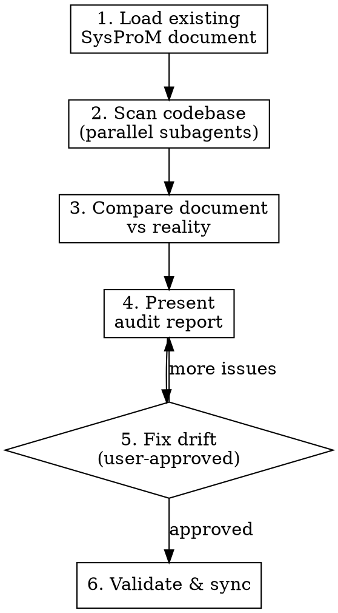

# Audit System

Compare a live system against its SysProM document to detect drift. Finds nodes that no longer match reality, code that has no provenance, and invariants that are no longer enforced.

## When to Use

- Periodic health check after a period of development
- Before a release, to confirm provenance is current
- After onboarding new contributors who may not have updated the SysProM
- When the SysProM feels stale or incomplete

## Process



### Step 1: Load existing document

```bash
sysprom validate
sysprom stats
```

Review the current state — how many nodes, which types, any existing validation issues.

### Step 2: Scan codebase (parallel subagents)

Dispatch subagents to check each audit dimension. Each subagent reads the SysProM document AND explores the codebase, returning discrepancies.

**Dispatch these in parallel:**

| Subagent              | What to check                                                                                                                  |
| --------------------- | ------------------------------------------------------------------------------------------------------------------------------ |
| Ghost nodes           | Nodes in SysProM that reference files, modules, or concepts that no longer exist                                               |
| Undocumented code     | Significant modules, services, or APIs in the codebase with no corresponding SysProM node                                      |
| Decision drift        | Decisions recorded in SysProM whose selected option no longer matches reality (e.g. "chose SQLite" but codebase uses Postgres) |
| Invariant enforcement | Invariants claimed in SysProM that are not actually enforced (no lint rule, no test, no type constraint)                       |
| Relationship accuracy | Relationships that are structurally wrong (A depends_on B but no import exists, A refines B but they are unrelated)            |
| Staleness             | Nodes with outdated descriptions, names that no longer match, or statuses that should have progressed                          |

**Subagent prompt template:**

> You are auditing a codebase against its SysProM provenance document.
>
> First, read the SysProM document:
>
> ```bash
> sysprom query nodes
> sysprom query rels
> ```
>
> Then explore the codebase to check for [AUDIT DIMENSION].
>
> For each finding, report:
>
> - **Issue**: What is wrong
> - **Severity**: critical / warning / info
> - **Node**: Which SysProM node is affected (or "none" for undocumented code)
> - **Evidence**: File path, line, or command output proving the drift
> - **Suggested fix**: What should change in the SysProM document

### Step 3: Compare document vs reality

Collate subagent findings into a structured comparison. Cross-reference to avoid duplicates (e.g. a ghost node and a broken relationship pointing to the same removed module).

### Step 4: Present audit report

Present findings grouped by severity:

```
## Audit Report

### Critical (must fix)
- [ ] EL5 "Redis Cache" — module removed in commit abc123, node still present
- [ ] INV3 "No any types" — 14 uses of `any` found in src/legacy/

### Warnings (should fix)
- [ ] D7 "Use REST" — codebase now also has GraphQL endpoints (undocumented)
- [ ] CP3 → EL8 relationship: EL8 was renamed to EL12

### Info (consider)
- [ ] src/analytics/ has no SysProM coverage (3 modules, ~2000 LOC)
- [ ] CH19 status is "introduced" but all tasks are complete
```

**Wait for user to review before making any changes.**

### Step 5: Fix drift (user-approved)

For each approved fix, use the appropriate CLI command:

| Drift type         | Fix                                                                                             |
| ------------------ | ----------------------------------------------------------------------------------------------- |
| Ghost node         | `sysprom remove <id>` or `sysprom update node <id> --status retired`                            |
| Undocumented code  | `sysprom add <type> --name "<name>" --description "<desc>"`                                     |
| Decision drift     | `sysprom update node <id> --description "<updated>"` or add new decision                        |
| Broken invariant   | Update invariant description, or add enforcement, or retire                                     |
| Wrong relationship | `sysprom update remove-rel <from> <type> <to>` then `sysprom update add-rel <from> <type> <to>` |
| Stale status       | `sysprom update node <id> --status <new-status>`                                                |

### Step 6: Validate and sync

```bash
sysprom validate
sysprom json2md --input .spm.json --output .spm
```

Confirm zero validation errors after fixes.

## Severity Guide

| Severity     | Criteria                                                                         |
| ------------ | -------------------------------------------------------------------------------- |
| **Critical** | Node references something that does not exist, or invariant is actively violated |
| **Warning**  | Document is incomplete or inaccurate but not misleading                          |
| **Info**     | Opportunity to improve coverage or update stale metadata                         |

## Common Mistakes

- **Fixing without approval** — Always present the full report and wait for the user to approve changes. Some "drift" is intentional.
- **Over-reporting** — Not every file needs a node. Apply the same granularity standards as `discover-system`.
- **Ignoring relationship drift** — Relationships rot faster than nodes. A refactored module may still exist but its dependencies have changed completely.
- **Treating warnings as critical** — Incomplete coverage is normal for living systems. Only flag genuinely misleading provenance as critical.
