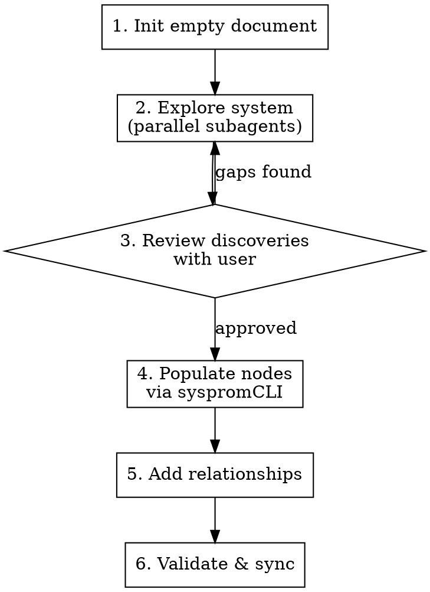

# Discover System

Bootstrap a SysProM document from an existing codebase. Explores the system systematically, extracts provenance information, and populates a new document with discovered nodes and relationships.

## When to Use

- Starting SysProM on a project that already has code, docs, and history
- Onboarding to an unfamiliar codebase and want structured understanding
- Creating provenance documentation retrospectively

## Process



### Step 1: Initialise

Create an empty SysProM document in the project root.

```bash
sysprom init --path .spm.json --format json --title "<Project Name>" --author "<Author>"
```

### Step 2: Explore (dispatch parallel subagents)

Launch exploration subagents to discover each node type. Each subagent searches the codebase and returns a structured summary — it does NOT write to the document.

**Dispatch these in parallel:**

| Subagent     | What to find                                             | Where to look                                                                                                                       |
| ------------ | -------------------------------------------------------- | ----------------------------------------------------------------------------------------------------------------------------------- |
| Intent       | Project purpose, goals, mission                          | README, CLAUDE.md, AGENTS.md, docs/, package.json description, repo description                                                     |
| Concepts     | Domain models, key abstractions, bounded contexts        | src/ type definitions, interfaces, schemas, domain models, glossaries                                                               |
| Capabilities | Features, APIs, services, what the system can do         | Route handlers, exported functions, CLI commands, public API surface                                                                |
| Elements     | Modules, packages, key files, infrastructure             | Directory structure, package.json workspaces, build config, Dockerfiles                                                             |
| Decisions    | Architectural choices, technology selections, trade-offs | ADRs (docs/adr/, docs/decisions/), commit messages, config file choices (tsconfig, eslint, framework config), CLAUDE.md conventions |
| Invariants   | Rules that must always hold, constraints, policies       | Lint rules, type constraints, test assertions, CI checks, validation schemas, CLAUDE.md rules                                       |

**Subagent prompt template:**

> You are exploring a codebase to discover [NODE TYPE] for a SysProM provenance document. Search thoroughly using Glob, Grep, and Read. Return a structured list of discoveries in this format:
>
> For each discovery:
>
> - **Suggested ID**: [TYPE_PREFIX][N] (e.g. I1, CN3, CP5, EL12, D7, INV4)
> - **Name**: Short descriptive name
> - **Description**: What it is and why it matters
> - **Evidence**: File path and line or source where you found it
> - [Type-specific fields: options/selected/rationale for decisions, conditions for invariants, etc.]
>
> Be thorough but avoid duplicates. Group related items. Aim for the right level of granularity — not every file is an element, not every function is a capability.

### Step 3: Review with user

Present a summary table of all discoveries, grouped by type. Ask the user to:

- Confirm, reject, or modify each discovery
- Identify gaps ("what about the caching layer?")
- Adjust granularity ("these three should be one capability")
- Add context the code doesn't reveal ("we chose X because...")

**Do not proceed to population without user approval.**

### Step 4: Populate nodes

For each approved discovery, create the node via the CLI:

```bash
# Intent
sysprom add intent --name "<name>" --description "<description>"

# Concepts
sysprom add concept --name "<name>" --description "<description>"

# Capabilities
sysprom add capability --name "<name>" --description "<description>"

# Elements
sysprom add element --name "<name>" --description "<description>"

# Decisions (with options and rationale)
sysprom add decision --name "<name>" --context "<context>" \
  --option "OPT-A:<description>" --option "OPT-B:<description>" \
  --selected OPT-A --rationale "<rationale>"

# Invariants
sysprom add invariant --name "<name>" --description "<description>"
```

### Step 5: Add relationships

Connect nodes with typed relationships based on what the exploration revealed:

```bash
sysprom update add-rel <from> <type> <to>
```

Common relationship types to look for:

| Pattern                | Relationship    |
| ---------------------- | --------------- |
| Intent → Concept       | `refines`       |
| Concept → Capability   | `refines`       |
| Capability → Element   | `realises`      |
| Element → Element      | `depends_on`    |
| Decision → Element     | `affects`       |
| Decision → Invariant   | `must_preserve` |
| Invariant → Capability | `constrains`    |

### Step 6: Validate and sync

```bash
sysprom validate
sysprom json2md --input .spm.json --output .spm
```

Review any validation warnings and fix before finishing.

## Granularity Guide

| Too coarse          | Right level                                   | Too fine                    |
| ------------------- | --------------------------------------------- | --------------------------- |
| "The backend"       | "Authentication service"                      | "validatePassword function" |
| "We use TypeScript" | "Strict TypeScript with no `any`" (invariant) | "tsconfig.json line 4"      |
| "The API"           | "REST API for user management"                | "GET /users/:id endpoint"   |

Aim for nodes that a developer would recognise as meaningful architectural units.

## Common Mistakes

- **Populating without review** — Always present discoveries to the user first. Code exploration misses context that humans know.
- **Too many elements** — Not every file is an element. Focus on modules, packages, and architectural boundaries.
- **Missing decisions** — The most valuable nodes are often decisions, which are hardest to discover from code alone. Ask the user about choices that shaped the system.
- **Forgetting relationships** — A graph without edges is just a list. Relationships capture the structure that makes SysProM useful.
